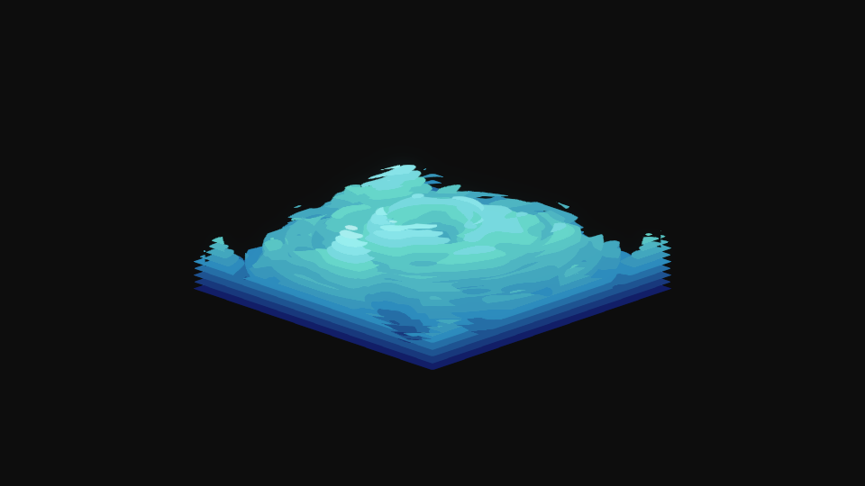

# NOISE

NOISE is a ~~lightweight~~, GPU accelerated, music visualizer for windows. Still in early development.

## Main Features

- Reactive to two different low frequency bands.
- The sensitivity for any band can be adjusted with the mouse scroll wheel. Use the lift and right arrow keys to change band.
- Simple debug layout that shows current sensitivity for selected frequency band and audio wave form with average and beat threshold. Activate it with F5.
- Screenshots with F2.

### Planned features

- Support for different colors and color effects.
- Support for more frequency bands with different effects.

### Known issues

- Currently the GPU usage is high, it needs some optimizations.
- If the audio source is changed it wont be detected and the visualizer needs to be restarted.

---
