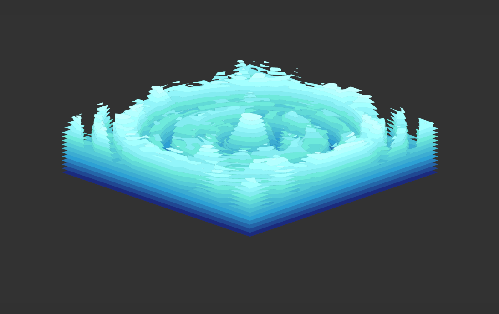

# NOISE
NOISE is a ~~lightweight~~, GPU accelerated, music visualizer for windows[^1]. Still in early development.

### Planned features
 - ???
---
[^1]: Right now I'm only planning for windows support, is the only platform I'm familiar with and in order to speed up development I'll be using [LASP](https://github.com/keijiro/Lasp) for the audio processing, for that I need to create a virtual (refer to this [issue](https://github.com/keijiro/Lasp/issues/33)) driver which is something I have no idea how to accomplish on other OS.
If you want to, you can contribute with the driver for other OS.
